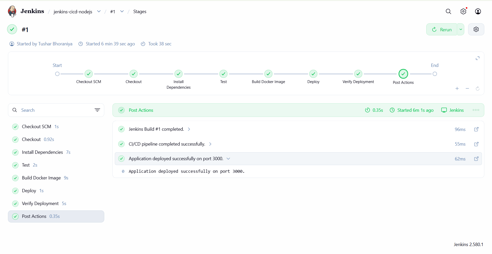
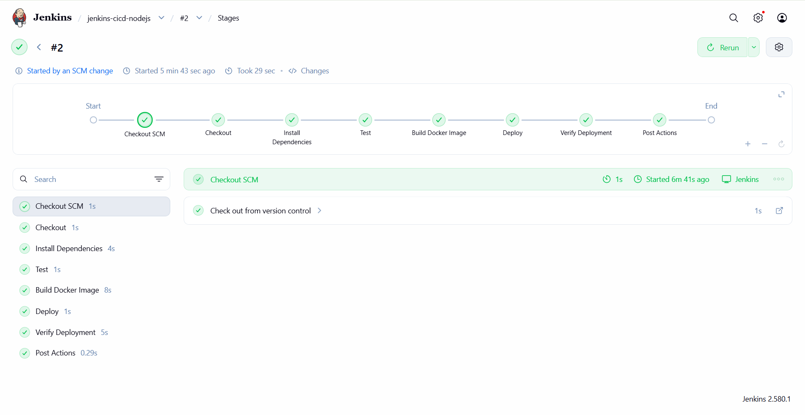
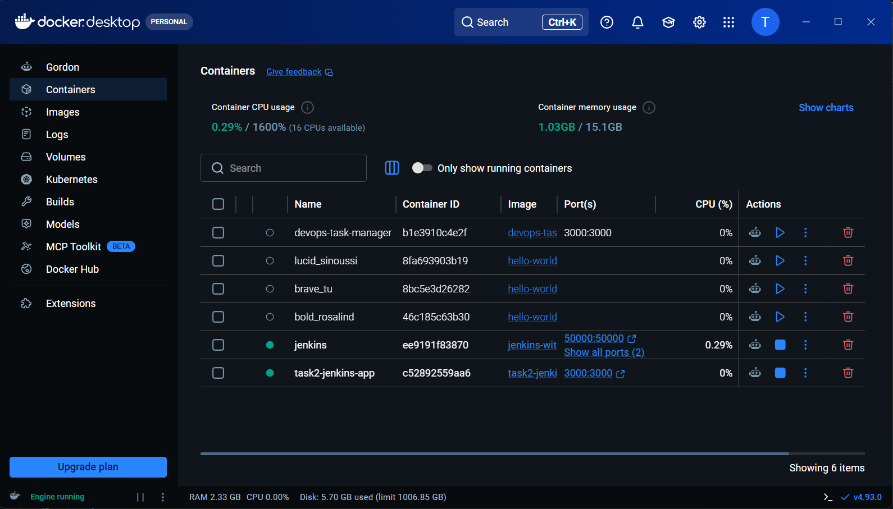
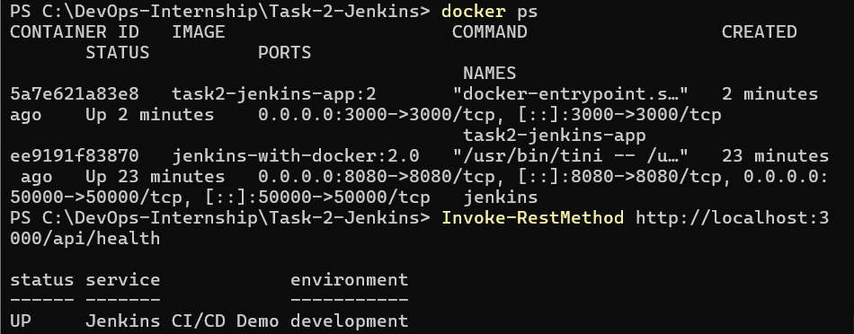
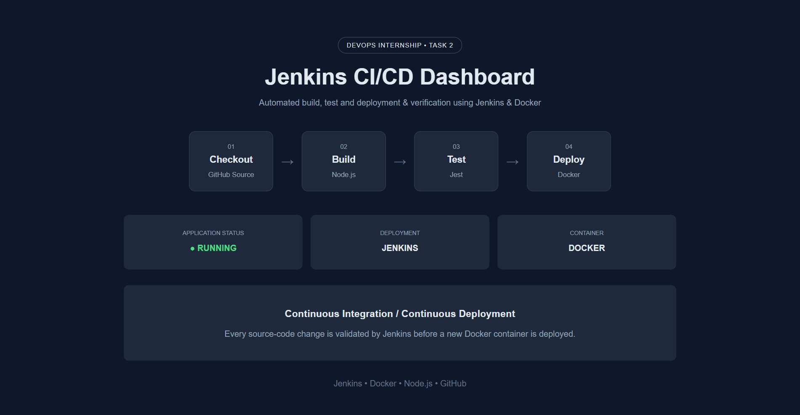

# Jenkins CI/CD Pipeline for Node.js Application

A complete CI/CD implementation using **Jenkins, Docker, GitHub, Node.js, Express, and Jest**.

This project demonstrates how a source-code change pushed to GitHub can automatically trigger Jenkins to test the application, build a Docker image, deploy a new container, and verify the deployment.

## Project Overview

This project was developed as **Task 2 of my DevOps Internship at Elevate Labs**.

The objective is to implement a Jenkins-based CI/CD pipeline that automates the software delivery process.

### CI/CD Flow

```text
Developer
    |
    | git push
    v
GitHub Repository
    |
    | SCM Polling
    v
Jenkins Pipeline
    |
    +--> Checkout Source Code
    |
    +--> Install Dependencies
    |
    +--> Run Jest Tests
    |
    +--> Build Docker Image
    |
    +--> Deploy Docker Container
    |
    +--> Verify Deployment
    |
    v
Running Node.js Application
```

## CI/CD Evidence

### Jenkins Pipeline Success

The Jenkins pipeline successfully completed all stages including checkout, dependency installation, testing, Docker image build, deployment, and health verification.



### Automatic Trigger from SCM Change

Build #2 was automatically triggered when Jenkins detected a new source-code commit through SCM polling.



### Docker Desktop Deployment

Docker Desktop confirms that both the Jenkins server and the application container are running successfully. The deployed `task2-jenkins-app` container exposes the application on port `3000`.



### Docker Deployment Verification

The deployment was additionally verified from the command line using `docker ps` and the application's health-check endpoint. The API returned an `UP` status, confirming that the deployed service is operational.



### Deployed Application

The Node.js application is successfully running after deployment through the Jenkins CI/CD pipeline.

